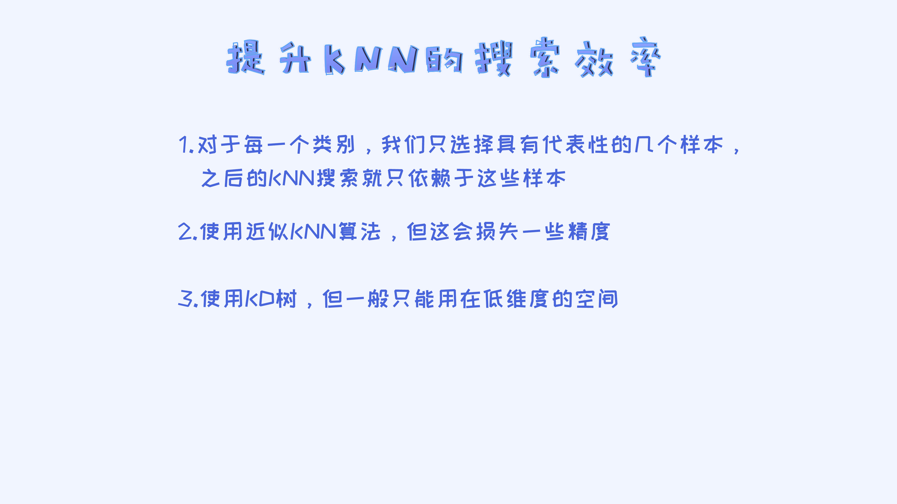
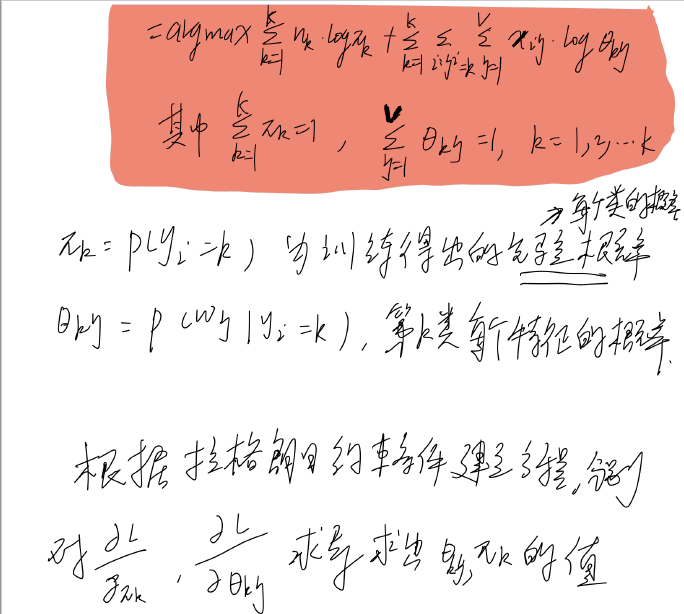
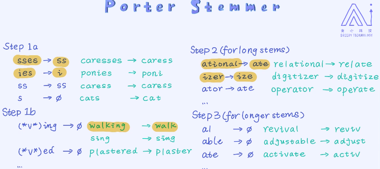
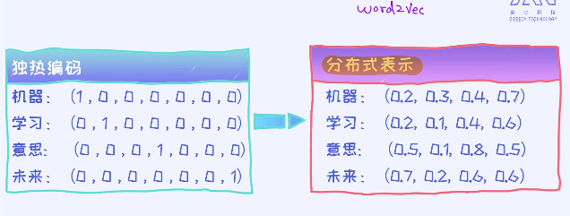
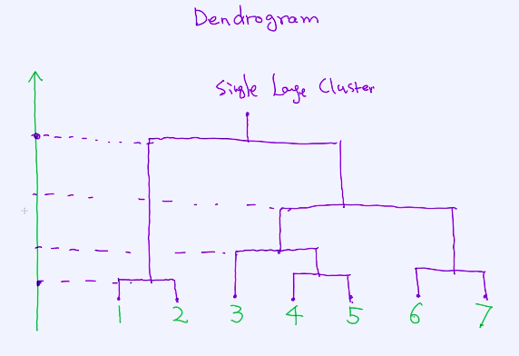
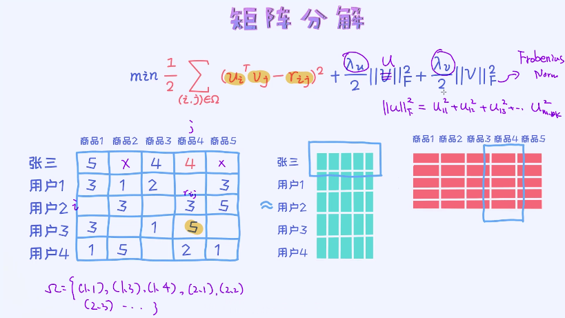

# ML

项目：图像识别，情感分析，金融风控，用户群体分析，广告点击率预测，新闻推荐。

​          chatbot中的意图，股价预测。

限制领域（narrow):特定场景特定问题

通用AI（general):让AI做任何事

特征工程：将输入数据转化成向量/矩阵/张量的形式

## **一.KNN：K邻近算法**

1.将数据特征化

2.数据需要提前标注好的样本

3.计算两个样本之间的距离或者相似度，才能选出最相近的样本

4.需要知道如何选择最合适的K值

​    **决策边界：**线性决策边界（线性模型）和非线性决策边界（非线性模型）

模型的泛化能力，可以简单理解成“它在新的环境中的适应能力”。

数据表现最好，测试不一定最好，图3为过拟合现象。

随着K值的增加，决策边界确实会变得更加平滑。决策边界的平滑也意味着模型的稳定性。

高斯分布

### **1.交叉验证(cross validation)**  

KNN决策边界 风险收益平衡

步骤：

1，把训练数据进一步分为训练和验证数据集

训练集训练模型，验证集评估模型的准确率。

#### 1.K折交叉验证(K-fold Cross Validation)：

将训练集分成K块，评估k个参数a（k组）的准确率，然后再取平均值。K称为超参数：不同K值对结果有影响，不取一次是为了避免偶然性。

数据量较少的时候我们取的K值会更大：因为数据量较少的时候如果每次留出比较多的验证数据，对于训练模型本身来说是比较吃亏的，所以这时候我们尽可能使用更多的数据来训练模型。由于每次选择的验证数据量较少，这时候K折中的K值也会随之而增大，但到最后可以发现，无论K值如何选择，用来验证的样本个数都是等于总样本个数（这句是废话）。

#### 2.留一法（leave_one_out）交叉验证：

K折交叉验证的特例-->K = N

对于KNN，K值一般从K=1开始尝试，也不会选择太大的值（耗费时间）

提升交叉验证的方法：并行化，分布式处理

※※※**KNN不能用测试数据来引导模型的训练，必须是训练数据集，测试数据是最后一步验证数据准确度使用！！！**

### **2.特征缩放**

特征标准化的方法：

#### 1.线性归一化：把特征值的范围映射到[0,1]区间

#### 2.标准差归一化：把特征值映射到均值为0，标准差为1的正态分布

%5CYoudao%5CqqB5DD2236E26B4B65B13FFAA3C53D40C9%5C871c4b7a8d1248c4957718395933211c%5Cclipboard.png)

### **3.KNN总结**

**第二点扩展：**当特征数量非常庞大时，要采用特征选择降低维度剔除相关性不大的特征，这样算法复杂度会降低，因此KNN不适合应用在大数据上，以及高维度的特征空间里

**第三点扩展：**KNN在训练时没有训练参数，核心阶段主要在测试阶段，只需选择测试阶段准确率最高的临近的K个样本即可

**第四点扩展：**算法时间复杂度跟样本个数N线性相关：减少样本数量，类似KD-Tree方案，LSH近似算法--降低算法时间复杂度

KNN模型的核心是计算距离

## **二.KNN进阶**

### 简介

#### 1.图像的特征：

1.特征工程：图像转化为像素值

2.rotation-invariant（旋转不变）

#### 2.颜色特征：

常用颜色直方图-R,G,B

SIFT（尺度不变特征转换）：局部特征，寻找图片中的拐点这类的关键点，处理得到一个

​                                              SIFT向量。

HOG（方向梯度直方图）：在单元格上，通过计算和统计图像局部区域的梯度方向直方图来构建特  

​                                           征。

#### 3.PCA(Principal Component Analysis)：

一种无监督的学习方法，可以把高维的向量映射到低维的空间里。它的核心思路是对数据做线性的变换，然后在空间里选择信息量（特征值影响）最大的Top K维度作为新的特征值。

### 1、缺失值的处理：

#### **1.删除法：**

1.第一种删除法是把相应的属性全部删掉，也就是删掉整个列。对于某一特征缺失较多的时候适用。

2.第二种删除法是删除相应的记录。 只要一个记录里包含了缺失值，就丢弃掉此记录，删除行。对于维度很多的数据，假如大量的维度都存在缺失值，这个方法很容易丢弃掉大量的样本。

#### **2.填补法：**

用新的值来填补缺失值。

1.平均值/中位数填补法：用特征的平均值来填补。

### **2、特征编码(feature encoding)**

将字符串等类别特征转换成数值类型的过程。

#### **1.独热编码(one-hot encoding)：**

在标签特征的基础上需要创建一个向量。这个向量的长度跟类别种类的个数等同的，另外，除了一个位置是1，其他位置均为0， 1的位置对应的是相应类别出现的位置。

#### **2.标签编码(label encoding)**

**数值型变量处理：**变量的离散化操作-连续性特征的离散化操作可以增加模型的非线性型，同时也可以有效地处理数据分布的不均匀的特点。

**顺序变量：**很少使用独热编码，因为这样就失去了大小关系。

### 3、KNN的复杂度分析以及KD树

近似KNN：搜索过程中会做一些近似运算来提升效率，但同时也会牺牲一些准确率。

#### **KD树（k-dimensional tree）：**

**1.kd树是二叉树，表示对k维空间的一个划分(partition)**

- 距离最短的点不一定落在跟预测样本同一个区域。
- 了保证能够找到全局最近的点，我们需要适当去检索其他区域里的点，这个过程也叫作**Backtracking（回溯）。**
- 随着特征维度的增加，KD树的搜索时间复杂度会指数级增加，因此不适合在高维空间里。主要是回溯会带来高频的搜索查找，造成维数灾难（curse of dimension）。

#### **2.KD树总结以及改进：**https://www.jianshu.com/p/abcaaf754f92

#### **3.应用场景**：

地图搜索最近的店

#### **4.带权重的KNN：**

思路是跟预测目标越近的样本给与了更高的权重，离预测目标越远的样本就越低的权重。最后做了加权平均。

条件概率

λ：超参数，人工定义值

距离：计算目标参数与样本参数之间的距离为欧式距离

δ函数：目标与样本之间类别是否一致

## 三.线性回归

### 1.一元线性回归模型

#### **1.线性回归特点：**

**线性--具有线性的决策边界   回归--解决回归类的问题**

- 模型简单且适用于大数据，训练速度块，资源消耗少
- 模型本身有非常好得可解释性--特征的有效、无效
- 变量x与y之间的线性关系

#### **2.损失函数（Loss Function）：**

预测与测量值之间的差异成为误差，一般用最小二乘法来计算--距离的平方

### 2.多元线性回归模型

涉及向量、矩阵、张量知识。

向量的范数(Vector Norm)：

#### 1.L2范数

#### 2.The Matrix Cookbook:

- 多元线性回归损失函数求导法则参考书
- 主要第二章

在多元线性回归中求解参数时矩阵不一定可逆--行或列线性相关即非满秩矩阵，这时需要采取措施：

- 去掉线性相关的特征
- 在XtX的基础上加一个单位矩阵：XtX + E

把导数设置为零的方式来求解参数， 这种方法也叫做解析解(Analytic Solution)。

### **3.线性回归模型的矩阵表示法**

- 最小二乘法（最小平方法）是基于误差为高斯分布（正态）的假设的来的。
- 在用线性回归做预测时，或多或少存在误差，因此引入误差变量epsilon，将误差看作是随机变量。
- 根据大数定理，样本数增多，误差会慢慢服从正态分布。

#### 1.误差函数模型

假设epsilon服从正态分布，针对每个样本得出条件概率：

#### **2.高斯噪声模型根据最大似然估计法求参数w,b:（优化最小二乘）**

与w,b无关的参数忽略--在求导过程中为0

#### 3.似然函数

## 四.逻辑回归-分类问题:

0-1问题：是否违约，情感分析（开心与否），广告点击率，疾病分析

逻辑回归本身解决的是二分类问题:p(y=1|x)和p(y=0|x)

建立逻辑回归模型要考虑定义域与值域的匹配问题，y与x的对应关系中，p(y∣x)的取值只可能落在（0，1）里

### **1.逻辑函数：**

采用线性回归建模的思想来处理逻辑回归的映射关系：

证明逻辑回归是线性分类器：

采用条件独立(conditional independence)的假设，在这个假设的前提下，可以把条件概率p(x1,…,xn∣w) 分解成p(x1∣w)…p(xn∣w)，构造极大似然函数。

将两个条件概率公式合并：当y=1时，后面那一项不起任何作用也就变成了第一个条件概率； 当y=0时，前面那一项不起作用，也就等同于第二个条件概率。

求解目标函数的最值：

- 导数为0：对逻辑回归不适用，导数表达式难以写出
- 迭代方法如梯度下降：不断更新参数，与lr参数相关。

### **2.梯度下降法：**

#### **1.求解w参数：**

#### **2.求解b参数：**

**迭代更新：**

w' = w - lr * f'(w)

b' = b - lr * f'(b) 

f'(w,b)为损失函数

#### **3.判断收敛：**

- 相邻时间段计算当前的损失函数，损失函数变化很小或者不变即收敛
- 相邻时间段计算当前参数的值w,b,参数值变化很小或者不变即收敛

## **五.大数据的利器：随机梯度下降法**

### 1.介绍

传统**梯度下降**全部样本循环迭代次数过多

#### **1.随机梯度下降法核心：**

每一次的迭代更新不再依赖于所有样本的梯度之和，而是仅仅依赖于其中一个样本的梯度：

- 随机梯度下降法计算由于仅依赖其中一个样本，与使用整个样本计算的梯度会有偏差，即会产生梯度的噪声

#### **2.小批量梯度下降法（mini-batch gradient descent）**：

它不依赖于所有的样本，但也不依赖于仅仅一个样本，而是它从所有样本中随机挑选一部分样本来计算梯度并更新参数--梯度下降和随机梯度下降的折中（两个极端的折中）

#### **3.三者比较：**

**样本，时间复杂度，稳定性，计算速度，应用场景**

#### 4.鞍点（saddle point）

它的梯度为0，但并不是局部最优解，如上面图里绿色和红色的相交点：

### 2.多元逻辑回归

二分类改造成多分类：

- 不能单纯的添加标签数进行多分类，虽然概率落在（0，1）区间，但是SUM值不为1的话，改造就不合理
- 由此引进Softmax函数

## 六.正则与过拟合

### 1.背景：

在数据**线性可分**时，会有多种方法供选择，而算法会选择最大似然值（MLE），这时在逻辑回归建立函数模型时采用sigmoid，这时w变得非常大，趋近于∞，可以将两类完美分开，这时需要添加参数防止w过大。

**解决办法：**增加L2范数，防止w变得太大

函数目的：求argmin 整个式子的最小值。

若λ->∞，导致w=0，即λ很大的时候，正则会很大即整个式子值很大这就违背了argmin。

λ=0，则w无限制，但w还是会变得非常大，这就是**模型的过拟合**（训练表现现的太好，而实际测试时并不是这样，**泛化能力差**）。

因此λ值要选择合适得值，一般采用交叉验证法来选取。

加完正则后随机梯度下降法：

构建泛化能力强的模型要点：

越复杂的模型越容易过拟合

后果：模型的决策边界非常陡峭，而且这种陡峭的决策边界会带来不太稳定的模型效果。比如其中的一些点上加了一些噪声，让点的位置稍微偏移一点点，很有可能就会判断错误。

### **2.避免过拟合：**

### **3.正则的作用：**

- 对可行解空间的限制即缩小可行解空间
- 被丢弃的解空间是比较容易产生过拟合的（约束过）
- 正则是一种能够把先验知识加入到模型里的最直接的方式

### 4.正则与后验概率

由于L1与L2的几何图像的特殊性，L1带有顶点，与f（w)相交时，可能使某个wi参数为0，这就造成了L1参数会产生稀疏性。

比起L2，L1确实有更多的功效。但从计算的角度来讲，L1范数的挑战要大很多。一旦目标函数里包含了L1的正则，则优化起来会比较麻烦。主要的原因是L1范数在0点不具备梯度，所以需要做一些特殊处理，比如使用subgradient来代替梯度。

L1范数虽然有特征选择的功能，但也有一些不足。比如多个特征具有强相关性，那通过L1正则选出来的特征可能是这些特征里的任意个（**稀疏性的原因**），但实际上特征还是有好有坏。

#### 1.扩展：ElasticNet

联合L1和L2正则一起使用，这个模型就是非常著名的**ElasticNet，**ElasticNet又叫弹性网络回归：

Sklearn库中有sklearn.linear_model.ElasticNetCV和sklearn.linear_model.ElasticNet两个函数可供选择，前者可以通过迭代选择最佳的 λ1 和λ2 （当然你可以指定一组值），后者需要你指定λ1 和λ2的值。

#### **2.正则与最大后验概率--MAP与MLE**

*对最大似然函数后续作个详细解读（在样本集D里寻找n个样本，最大化观测样本的概率p(D∣θ)，寻求参数最优解）

MAP比MLE多出一个项P（θ）——先验概率，可指定：通过先验的方式来给模型灌输一些信息， 比如模型的参数θ可能服从高斯分布，我们就可以假定先验就是高斯分布。

参数的先验概率服从高斯分布，则MAP等于在MLE的函数上加了L2正则。

同理参数先验概率若服从拉普拉斯分布，则MAP等同于在MLE的函数上加了L1正则

*当数据量越来越多的时候，最大后验估计逐步逼近于最大似然估计：

当**数据量较少时最好选择MAP估计，因为这时候容易过拟合**，而且MAP正好相当于加入了正则项。相反，当数据量足够多的时候，可以不采用MAP估计。

log函数的N值（采集样本值）会越来越大，导致argmax越来越大，logp(Θ）权重变小，因此越来越趋近于MLE。

## 七.广告点击率项目（后续实践）

### 1.精确率，召回率，F1-Score

实际上非常简单，**精确率**（precision）是针对我们**预测结果**而言的，它表示的是**预测为正的样本中**有多少是真正的正样本。那么预测为正就有两种可能了，一种就是把正类预测为正类(TP)，另一种就是把负类预测为正类(FP)，也就是

而**召回率**(recall)是针对我们**原来的样本**而言的，它表示的是样本中的正例有多少被预测正确了。那也有两种可能，一种是把原来的正类预测成正类(TP)，另一种就是把原来的正类预测为负类(FN)。

其实就是分母不同，一个分母是预测为正的样本数，另一个是原来样本中所有的正样本数。

**准确率**（accuracy）针对整个样本而言 

**FI-Score**是Precision和Recall加权调和平均：
P*R%7D%20%7Ba%5E2(P+R)%7D%20%5Chfill%20(3))

当参数a=1时，就是最常见的F1了：
)

很容易理解，F1综合了P和R的结果，当F1较高时则比较说明实验方法比较理想。使用F1-Score, 这个值越大，就意味着模型表现越好。 当我们计算完每一个类别的F1-Score之后，可以通过求它们的平均来获得最终整体的F1-score 。

### 2.特征选择技术

#### 1.尝试所有组合

有n个特征，一共有2的n次方-1种

 这种方法的主要问题在于时间复杂度太高 ，只适用少量的数据。

#### 2.贪心算法

#### 3.L1正则

 L1正则特别适用于样本量少，但特征维度特别高的情况（产生稀疏性的原因）。一个经典的场景就是神经科学 

#### 4.使用树算法

特征的重要性从根到叶节点一次降低

#### 5.相关性计算

 计算变量之间的相关性，这种方法不跟某一种机器学习算法绑定在一起 

chi-square test

perason correlation

### 3.网格搜索与贝叶斯优化

#### 1.网格搜索（Grid Search）

超参数搜索算法，复杂度与搜索的超参数个数相关。

#### 2.贝叶斯优化与遗传算法（高阶）

## 八.朴素贝叶斯

### 1.概念

文本分类领域的经典算法，非常靠谱的基准（baseline）

统计出不同文本类别中出现的词频。对于垃圾邮件的分类任务，我们需要统计哪些单词经常出现在垃圾邮件，哪些单词经常出现在正常的邮件里。 

朴素贝叶斯的核心思想：统计单词在不同类别种出现的概率（先验），然后根据这些结果进一步判断一个文本它属于不同类别的概率。

过程：先训练（统计不同类别中各单词的概率），后测试

 预测时用到了条件独立(conditional independence)的假设。简单来讲，通过这个性质可以把条件概率p(x,y|z)写成p(x|z)*p(y|z)p(x∣z)∗p(y∣z)的形式 ，即：

​        p(x1,x2,x3∣y)=p(x1∣z)p(x2∣z)p(x3∣z) 

**各条件相互独立即为“朴素”的意思**。

#当某个条件在样本里的概率为0时，会导致预测结果为0，这是不合理的，因此需要对其做一些处理。

平滑处理：

1.add-one smoothing(加1平滑)

****

v:词库大小，即所有单词个数，保证相加后的概率和等于1

**underflow现象**：统计的关键词很多时，由于每个词频在0到1之间，累乘后结果会变得非常小，导致数值不准确。

**解决办法**：式子前加log函数，这样由于其是一个递增函数，因此也便于判断。

**混淆矩阵**是分类问题中经常用到的评估技术。对于二分类问题最后打印出来的二乘二的矩阵。**对角线的数为被正确分类的个数**。通过混淆矩阵我们可以分析出哪几个类别被分类错的概率更大，之后就可以针对性的去调整就可以了。 

### 2.最大似然及参数估计

#### 1.目标函数

P(x,y)的联合分布概率--生成模型，区别于逻辑回归的P（y=?|x)的条件概率--判别模型

xi:特征向量，yi:标签（如下所示一共三种标签）

#### 

#### 2.参数求解（拉格朗日条件极值法）

 这个式子中分子代表的是在所有类别为$k$的文档里出现了多少次 ![[公式]](https://www.zhihu.com/equation?tex=w_j%EF%BC%8C) 也就是词典库里的j个单词。分母代表的是在类别为k的所有文档里包含了总共多少个单词。 

**θkj：第k类出现的单词j/k类别文档包含的单词数，Π：每种分类的概率**

### 3.高斯朴素贝叶斯

将连续型的特征，采用中心极限定理（连续型样本数量多时）的概念，利用朴素贝叶斯的思想（假设各特征独立），将其拟合成高斯分布。

实际的工作当中，如果数据中有大量的连续型特征，我们其实是不会使用朴素贝叶斯模型的，而是使用**逻辑回归、XGBoost**等模型。 

### 4.生成模型与判别模型

**生成模型**指的就是一种可以用来**生成数据或者样本**的模型。训练一个生成模型不仅可以用来完成识别任务，也可以生成一些样本，包括图片、文章、代码、视频、音频等等 。

**判别模型**主要用来判别样本的类别

生成模型不仅判断了类别，还记住了该类别的特征

数据量少生成模型判别效果比判别模型好（数据量少容易过拟合，生成模型可以防止过拟合）

## 九.情感分析

监控舆情、量化投资、竞品分析

停用词： 就是那些出现特别频繁，但对于一个句子贡献不是特别大的单词 。

停用词库的构建方法：

1. 手动去设置停用词库，把所有的停用词写入一个文件 
2.  从网上搜索停用词库，一般来讲网络上可以找到大部分语言的停用词库，这些都是别人已经整理好的，所以基本都是通用的 
3.  从第三方工具中导入停用词库，比如NLTK这些工具已经集成了不同语言的停用词库 （直接调用）

### 1.文本的预处理

stemming： 通过一条条规则来把一个单词转换成标准的形式 

lemmazation ：规则更严格，转换的都是valid word如fly,deny

### 2.文本表示与tf-idf

#### 1.单词与句子的表示方法

单词的表示：独热编码

句子的表示法：boolean表示，count表示，tf-idf表示

boolean表示：使得向量变的非常稀疏，不出现的词全为0，而且向量长度等于词库的长度。而且出现的次数这个信息没有展现。

Count表示法：sklearn库里的CountVectorize类

Tf-idf:词频*权重

#### 2.计算文本相似度

##### 1.计算欧式距离

距离越大相似度越小

##### 2.计算余弦相似度

余弦值越大，角度越小，相似度越大 

#### 3.分布式表示与word2vec

采用独热编码是不可以用欧式距离或者余弦相似来计算语义相似度的。

独热编码：稀疏的向量表示

word2vec：稠密的向量表示- 分布式表示法(Distributional Representation) 

对于词向量的降维，最经典的方法叫做**T-SNE** 

sklearn也集成了此方法： https://scikit-learn.org/stable/modules/generated/sklearn.manifold.TSNE.html 

学习单词的分布式表示（词向量）:提前设置维度,训练出来的维度就是多少维度（dimension）

NNLM

CBOW/SKIPGRA

GLOVE

MF(矩阵分解)

高斯 Gaussian Embedding

ELMo  Bert   XLNet

表示句子的方法：

平均法（average pooling）

给定单词的向量，我们通过平均法则即可得出包含若干个单词的句子向量， 接着再使用句子向量去做分类模型。 

我们用100维来表示单词，则在独热编码的情况下我们最多能表示100个不同的单词。 但是在分布式表示法的情况下可以表示无穷多个单词 

## 十.决策树

### 1.介绍

学习决策树：树的形状结构（structured prediction），决策的阈值（边界），叶节点的值

结构的学习很多都是NP-hard问题：就是那些多项式时间复杂度内基本上解不出来的问题，一般需要指数级复杂度

不同特征作为根节点构造的决策树不同：

以工作年限为特征根节点构造决策树时，分类的准确率是80%。

决策树算法就是从庞大的不同决策树选出最优的决策树。

### 2.不确定性以及信息增益

信息熵：

例2比例1的不确定性要小，H2<H1，信息熵越小不确定性越小。

原来的不确定性（未按特征分割），分割后的不确定性（按不同的特征分割)，差值即为信息增益，增益越大，表明不确定性越小越适合作为决策树的根节点。

构建决策树：

以time特征构建决策树的信息增益，然后依次以Matchtype,court surface,Best Effort为特征构建决策树，注意**加权平均**。依此类推，不断分裂，知道不能分裂为止。

### 3.决策树的过拟合及措施

对于决策树我们如何减少过拟合现象？ 答案就是：决策树越简单越好！

标准：

1. 节点数越少说明数越简单。直接减少节点个数在实际操作中不太容易实现，因为决策树的构建过程其实是**递归**的过程。
2. 限制树的深度。树的深度越深，一般来讲节点个数也会越多。

深度，叶节点样本个数的限制来避免过拟合。

### 4.对于连续性特征的处理

决策树对于离散值的处理很简单，就是针对特征值创建分支

对于连续型的特征：对于每个阈值都尝试一遍，同样的特征可以重复使用

#### 1.回归问题（预测）：

连续型变量的“信息增益”或者“不确定性的减少”无非就是前后标准差（或者方差）的变化！

## 十一.随机森林

### 1.集成模型和它的优势

构建ensemble model(集成模型)：

- Bagging:随机森林

- Boosting:GBDT,XGBoost

为什么集成模型的可解释性好呢？ 这个其实不难理解，因为随机森林或者提升树模型其实是**基于决策树**的，而且我们知道**决策树模型的可解释性本来就很好**（稳定性优先）。**集成模型可以简单理解成决策树的集合！**

Bagging训练预测过程：

每个模型互相独立，预测结果需要投票决策（回归问题的最终预测结果等同于做了平均的操作）选择最终的预测结果。

### 2.从方差的角度分析其稳定性

稳定性-->方差小

### 3.随机、多样性以及模型的训练

随机森林的预测过程无非是多棵决策树共同作出决策。比如对于分类型问题，可以通过**投票的方式**； 对于回归问题，则可以**采用平均法则**。

#### 1.构造随机森林需要考虑的点：

- 一份训练数据多颗决策树

- 确保多颗决策树要优于单颗决策树
- 多颗决策树如果相关性大，做不到增加稳定性的作用，稳定性的基础使多样性（Diversity）。

#### 2.随机森林的多样性：

- 训练样本的随机化：随机在样本集里选择一部分样本
- 特征选择时的随机化：在特征集里随机选择一部分的特征

采样过程：Bootstrap-可重复采样（sample with replacement）

### 4.过拟合以及措施

sklearn中随机森林分类器模板：https://scikit-learn.org/stable/modules/generated/sklearn.ensemble.RandomForestClassifier.html

控制树的深度（防止过度分裂），叶节点样本个数（分裂界点），树的个数（树越多越稳定）

## 十二.提升树：多个学渣共同决策

### 1.提升树（Boosting）核心思想

Bagging是很多**过拟合**的weak leaner来组成-overfitting

Boosting是很多**欠拟合**的weak learner来组成-underfitting

搜一下 "generalization bound", "PAC learning"等关键词来了解一下Boosting在这块的一些理论工作。

### 2.基于残差（residual）的训练方式

Bagging训练是并行，基于残差是串行

在预测阶段其实跟Bagging是不一样的，因为在**Bagging里每棵树是独立训练的**，互不影响，所以最后决策时**需要投票决策**。但**Boosting的情况不一样，训练是串行的**，一个接一个，每一棵树的训练都**依赖于之前的残差**。基于这些特点，对于**Boosting我们应该要求和**而不是平均！

XGBoost学习路径：

构造目标函数--优化目标函数（直接优化比较难，近似方法进行-泰勒展开）--树的结构引入目标函数--仍然难优化，贪心算法？

### 3.XGBoost目标函数构建

第k颗树来预测样本xi的值

XGBoost既可以用在回归问题上，也可以用在分类问题上

**损失函数：**

回归问题-最小二乘法

分类问题-交叉熵

**控制复杂度：**

正则L1，L2

树过拟合

1.树的深度越深就越容易过拟合

2.树的深度越深，叶节点越多，也越容易过拟合

3.预测值越大模型越复杂，预测值越少模型越简单：在回归分析中，最终的预测结果是所有决策树预测结果之和。所以从这个角度可以这么想，如果一棵决策树的预测是比较少，那相当于这棵树带来的影响就会越小，当然这也说明我们需要更多的树。

优化未知部分（黄色），已知部分看作常数（绿色）

### 4.泰勒展开式与目标函数的近似

#### 1.用泰勒展开式近似目标函数

### 5.树的参数化

### 6.利用贪心法构建每一棵树

需要寻找一种树的结构使得预定义的目标函数最小

搜索问题其实有很多中方法，比如**brute-force算法**，**A*算法**，**贪心算法**等等

XGBoost API：https://xgboost.readthedocs.io/en/latest/

信息熵差值（增益）或者方差的增益--贪心算法

所以从整个过程也可以看得到，虽然一开始一步步试图构建参数化的目标函数，但最后还是回到了基于贪心算法的树的构建，跟决策树的构建很类似。

只不过我们在构建决策树时并没有试图去创建什么目标函数，而是直接通过信息增益来搭建，所以直接看到的是结果，省略了中间很多步骤而已。

### 7.金融风控

1.缺失值处理：特征超过一定比例缺失如60%，则全部删掉，设定阈值

2.二值化城市信息

3.字符串特征清洗：如北京市，北京，可以清洗后合并

4.可以设计一些衍生的特征。举个例子，有两组特征，分别是户籍的所在地和申请贷款时的所在地。当申请贷款时的所在地不同于户籍所在地的时候就意味着这个人是在异地申请的，有可能存在一些风险。

5.类别特征：独热编码

6.模型自带的feature_importances_来获取每一个特征的重要性，然后通过排序即可以得到每个特征的重要性。

7.评估方法：AUC(area under the curve)，是一种常用的用来评估二分类的评估标准：FP(false positive),FN(false negative),TP(true positive),TN(true negative)来画出一条ROC曲线，然后再计算它的面积，就可以得到AUC的值

https://scikit-learn.org/stable/modules/generated/sklearn.metrics.roc_auc_score.html#sklearn.metrics.roc_auc_score

8.https://zhuanlan.zhihu.com/p/28850865处理样本不平衡

## 十三.K-means-无监督学习

### 1.K-means流程

停止条件：中心点坐标没有变化时，算法停止

问题：

- K-means的目标函数是什么？
- 一定会收敛吗？
- 不同的初始化结果，会不会带来不一样的结果？
- K如何选择
- 

### 2.K-means细节

#### 1.构造K-means目标函数-面试题

#### 2.目标函数优化方法

**交替优化(Alternative Optimization)的方法**：目标函数里有两组不同的参数。我们可以分别对其中的每一组参数优化，但这时候相当于把另外一组参数当做是已知的就可以了。

第一步优化算法（分类）：假定uk已知，让目标函数下降，让γik朝目标函数变小的方向走

第二步优化算法（重新规划中心点）：已求出γik ，让uk朝目标函数下降的方向优化

因此目标函数一定会收敛。

**Coordinate Descent   EM算法（GMM-高斯混合模型）凸优化理论**

#### 3.K-means里的K如何选择？

与KNN里选择最好的K值不同，KNN里的K值选择如作图所示，Loss曲线下降过了某一个值会上升，而K-Means不同Loss曲线会在某一点之后下降越来越慢。

### 3.聚类分析

#### 1.RFM模型--用户分类

缺点：人工经验参与；措施：用K-Means算法对用户分类（特征需要归一化）

#### 2.聚类评估方法

A/B测试。比如我们手里有两种分群方案A和B。A方案是目前来讲比较有效的而且稳定的，B方案是想要尝试的而且很可能比较有效的。核心是如何用最小成本去验证某个方案的优越性。

## 十四.层次聚类

### 1.层次聚类与距离计算

不规则的样本，K-means指定K也无法成功分类，它无法捕获层次关系。因此引入层次聚类，不需要指定K。

Dendrogram：

自底向上的方法：合并，如上图。

自上而下的方法：拆解。

### 2.从下到上的层次聚类

从下到上的核心思想是：一开始每一个点是一个cluster, 然后把类似的cluster慢慢做合并，到了最后就只剩一个cluster了，这个时候即可以停下来。

聚类过程的一个核心是：相似度的计算，因为涉及到了不同cluster之间的合并。

计算两个cluster之间距离的3种方法：

**min:**两个cluster之间点的最小距离

**max:**两个cluster之间点的最大距离

cluster之间的距离变得越来越大，速度也越来越快

**Average（比较稳定）:**计算两个cluster之间所有点的距离再取平均值。

### 3.从上到下的层次聚类

一开始我们只有一个大的cluster, 由所有的样本组成，之后逐步把每一个cluster切分成更小的，直到每一个cluster只包含一个样本为止。

采用最小生成树（MST）算法来完成自上而下的分层：Prime适合稠密图选点，Kruskal适合稀疏图选边。

### 4.层次聚类与交叉验证

每次合并之后簇之间的距离会逐渐增大，到达某个点之后 距离的增长可能会比较缓慢，

但达到这个点之后，增长就会突然快起来。这就是需要的临界点。

## 十五.推荐系统

### 1.概论

基于内容的推荐和基于协同过滤的推荐

### 2.基于内容的推荐

把每一个商品转换成了向量的形式，所以相似度的计算无非就是要度量两个向量之间的相似度。最经典的评估方法就是使用余弦相似度。在这个方法论下，**物品向量尤其重要**，如何准确地刻画物品向量决定着整个系统的性能。

核心是首先构造商品画像，之后根据此画像来寻找最相似的其他商品

相似度计算：余弦相似度

### 3.商品向量的构建

### 4.商品相似度计算

基于内容的推荐还有一个大的问题，就是如何去维护物品之间的相似度。这是一个庞大的矩阵，设想一下总共有N个商品。那这个矩阵的大小为N乘N，数量级很大。

- 每隔一段时间计算一次（一天或者二天一次）
- 稀疏性，趋向0的忽略掉，线下计算出的相似度高的放入缓存

### 5.总结

新闻包含很多文本，包含内容比较多

商品构建画像

## 十六.基于协同过滤的推荐系统

### 1.概念

**核心：**是找到“品味”类似的人，然后推荐别人喜欢的给用户。

**多样性：**这种推荐方式区别于基于内容的推荐，具备一定的多样性。也就是之前没有关注过的产品，也会得到推荐，这也叫作多样性。

**冷启动问题：**比如一个用户之前没有任何购买记录，那我们也无法判断当前用户到底跟哪些其他用户具有相似性。

协同过滤使用的三个问题：

- 计算用户之间的相似度：表示用户的向量

  

  由于每个用户的评分标准不一样，这里将每个人的评分取平均值后再计算两者之间的相似度。

- 考虑多少个近似的用户：从计算结果过滤，选择靠前的

- 预测评分：

  

  相似度S计算了之后，取相似度靠前的进行加权平均。

  

### 2.隐变量模型与矩阵分解算法

m*n的矩阵，m代表用户数量，n代表商品总数。将这个矩阵分解为两个矩阵，也就是分别代表用户向量和商品向量，可以理解为embedding，类似于词向量。

矩阵分解是从历史交易数据中学习除用户和商品的向量，那么向量的维度人为指定，是一种超参数（可通过交叉验证的方式来设定）。

k通过交叉验证方式指定，但分解后的用户向量（行向量）和商品向量（列向量），可解释性比较差。

分解出的向量相对于人为构造的向量维度比较低。

特征工程构造画像或向量的预期：低冗余，低噪声，低维度

人为设定的特征会有相关性，不是相互独立的，有相关性的特征会成为冗余的特征，也会有噪声影响（无用的特征），因此将高维的数据特征映射到低维空间。

### 3.矩阵分解的优化问题

#### 1.矩阵分解

F-范数：矩阵的frobenius norm，矩阵每个值的平方相加，控制矩阵的值不要过大

#### 2.梯度下降法求解参数：

ui的转置，行向量。

#### 3.协调过滤的优缺点：

对于新用户没有办法计算与其他用户的相似度，冷启动问题严重

可解释性比较差的，分解出来的矩阵无法解释why。

#### 4.融合冷启动的解决方案

传统方式：问卷调查，个人信息表，推荐热度很高的商品

对于新用户没有数据的时候，任何的推荐其实不具备个性化的，这个跟算法没有关系，只跟数据有关系。

exploration vs exploitation：

根据用户行为推荐他喜欢的商品，但同时也推荐一些新的产品给到用户；不断挖掘用户新的兴趣点

推荐系统领域的线上和线下的融合：

wifi探测器，线下检测手机与商品铺的交互，逗留时间，根据行为数据进行推荐；公共场合都具有一些传感器，然后通过这类传感器来搜集用户的轨迹数据

online offline recommendation