# 一.凸优化基础

## 1.介绍

ML：ICML,NIPS,AISTAT,UAI,ICLR

NLP:ACL,EMNLP,COLRG,NAACL

CV:CVPR,TCCV

DM:ICDD,WSDM,ICDM

AI:AAAI,IJCAI

HTTP://ARXIV.ORG

http://cvxopt.org/userguide/coneprog.html#

## 2.凸集、凸函数、判定凸函数

### 1.Optimization-优化

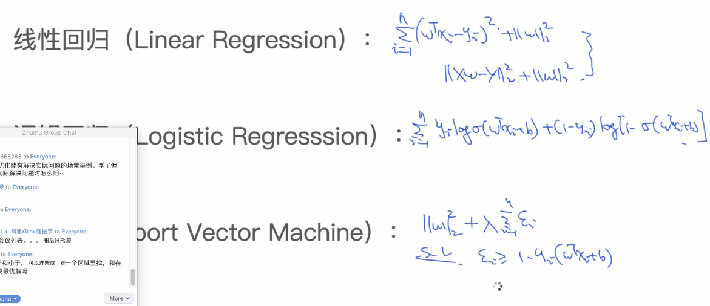

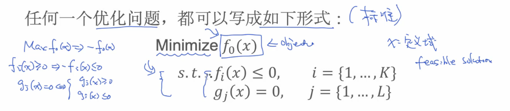

### 2.Optimization-Categories优化分类

标准形式进行判断分类，从四个方面给目标函数分类：

- Convex   or  non-Convex

  是否是凸函数，如果是能有全局最优解，如果不是只有局部最优解

  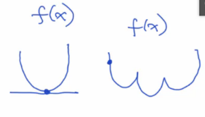

- Continuous   discrete

  连续，离散

- constrained  un-constrained

  带条件 不带条件

- smooth non-smooth

  平滑 不平滑

### 3.凸集、函数

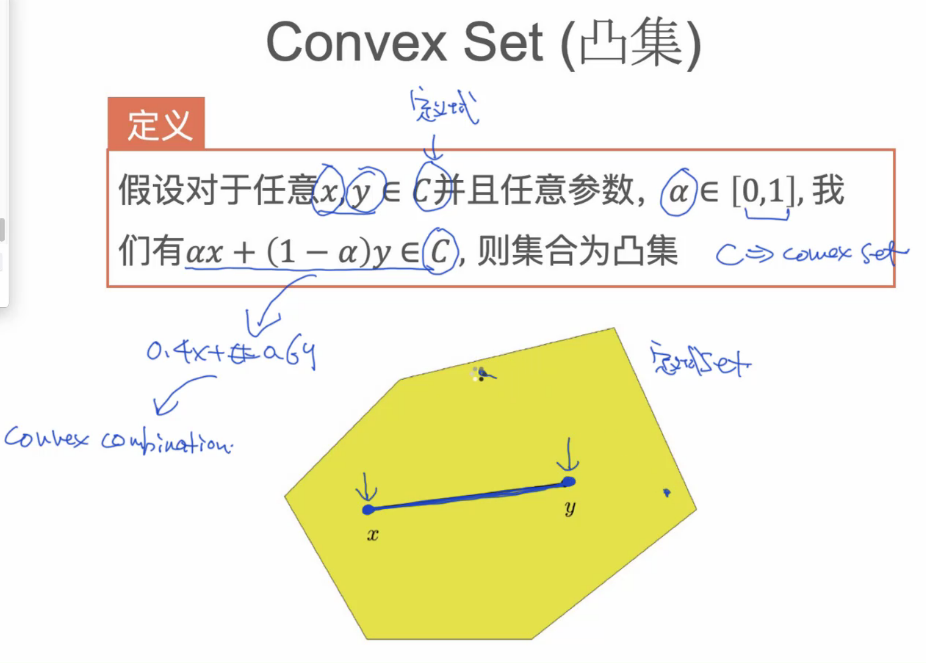

x,y：αx + (1-α）y实际就是两者连线上的点都在此集合内，称为凸集。

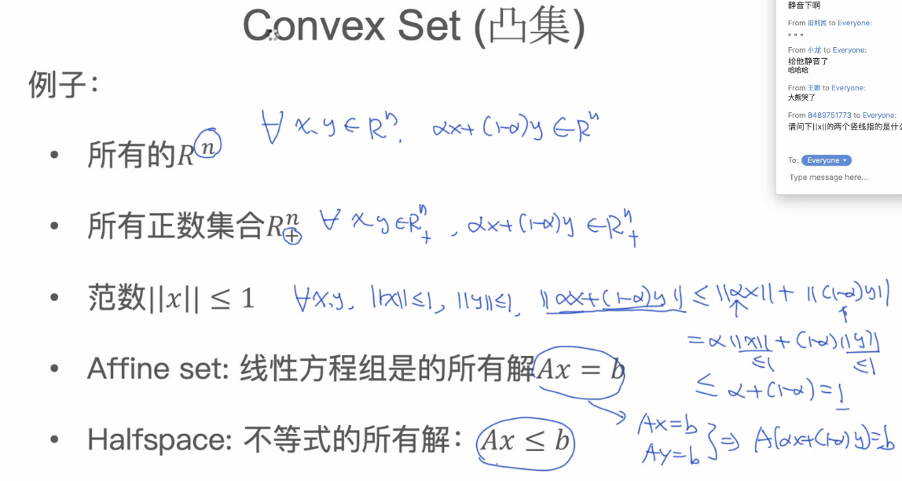

定理：两个凸集的交集也是凸集

凸函数（Convex Function）:函数的定义域dom f为凸集，对于定义域里的任意x,y,函数满足f(αx + （1-α）y) ≤ αf(x) + (1-α)f(y)

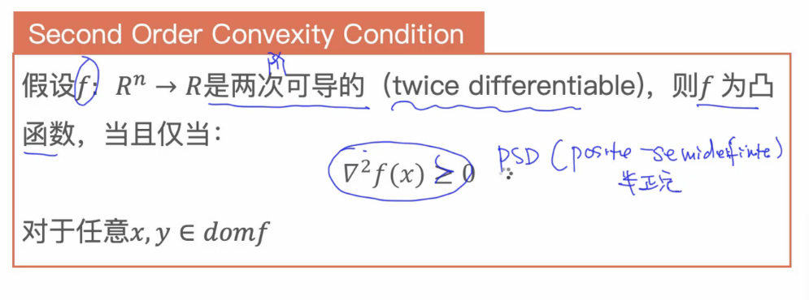

海塞矩阵半正定 
$$
xTAx ≥ 0
$$

### 4.Transportation Problem(转换问题)

LP（Linear Problem）:线性规划问题

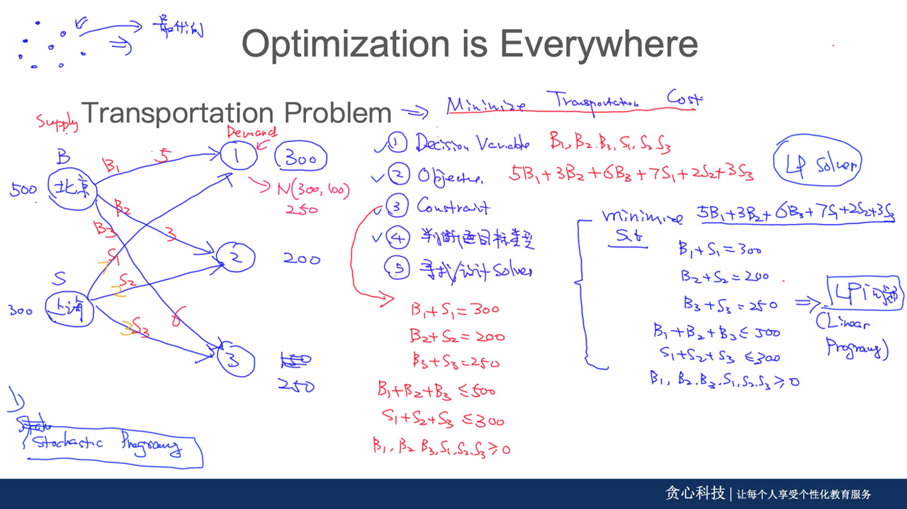

建立线性方程，以及线性约束条件方程

### 5.Portfolio Optimization(股票组合优化)

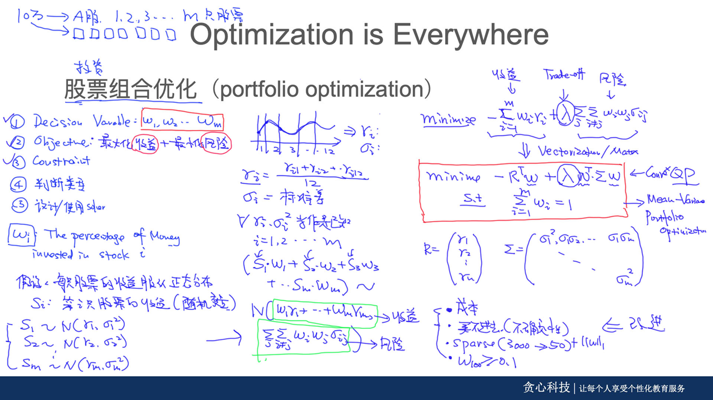

多元高斯分布：https://www.cnblogs.com/bingjianing/p/9117330.html

Quadratic Programming 二次规划，实际股票要考虑问题较多，可能最后就不是凸优化问题。

### 6.Set Cover Problem(集合问题)

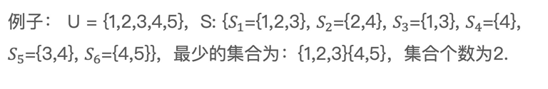

Approach 1:Exhaustive Search(穷举)，复杂度O($2^N$)

Approach 2:Greedy Search(贪心)

用数学表达式表述问题：s.t.(such that  or  subject to)

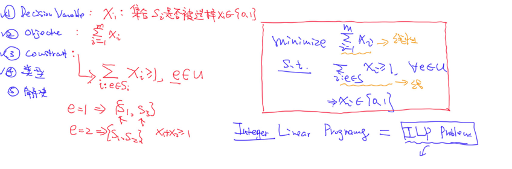

**步骤：**条件变量、目标函数、约束条件、类型（ILP Interger Linear Programming，非凸函数）、解决

### 7.Duality(对偶问题)

计算的方便 

Lower bound property

Strong and Weak Duality

Complementary Slackness

KKT Conditions

Primal and dual(原函数和对偶函数)

任何一个问题从不同角度去对待，然后在不同角度做决策,通过拉格朗日约束条件计算结果：

结果相同就是强对偶，结果不同是弱对偶

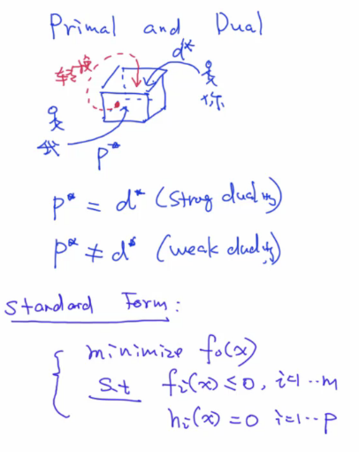

infimium 与最小值有区别：x < 1, inf x = 1,而最小值却不是。

#### 1.基于拉格朗日的dual,KKT条件:

- primal函数在拉格朗日约束条件下是求x的值使f(x)值最小，而dual函数是把求出的x看作常量，转而去求λ，ε使g(λ，ε）函数值最大，这里λ≥0.

- 这里primal和dual所求函数值会存在一个gap，如果p* ≥ d*，满足KKT条件，强对偶关系。

  

  这些求解条件就是KKT条件：(1)是对拉格朗日函数取极值时候带来的一个必要条件，(2)是拉格朗日系数约束（同等式情况），(3)是不等式约束情况，(4)是互补松弛条件，(5)、(6)是原约束条件。
  
  KKT条件是d∗=p∗的必要条件，给出了当原问题和对偶问题等价时对应最优值点所满足的性质。
  
  尽管KKT条件是d∗=p∗的必要条件，但当原问题是凸优化问题时，它就升级为充要条件，也就是只要找到x∗,α∗,β∗x∗,α∗,β∗ 满足以上五个条件，那么原问题就和对偶问题就有相同的解

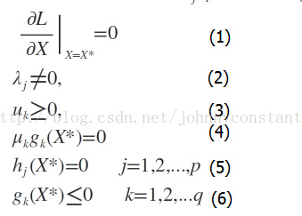

- primal是凹函数的话，dual是凸函数，而且如果primal参数过多而条件少无法求解最佳值时，转换成dual就是方程多，参数少的问题，这样就很容易求出对应的最佳解值
- dual可以确保primal的解法是否正确
- svm的kernel  在问题转换成dual时会获得新的现象

#### 2.向量矩阵下的dual问题

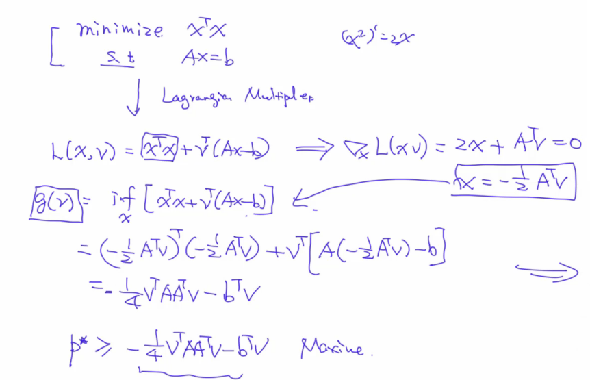

强弱对偶：

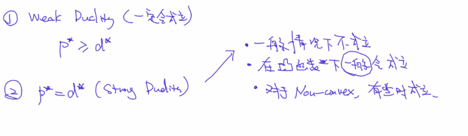

#### 3.slate条件：

对于凸函数满足强对偶

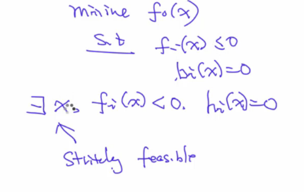

可行解x是满足s.t里的Fi(x) < 0.

#### 4.Complementary Slackness（松弛互补）

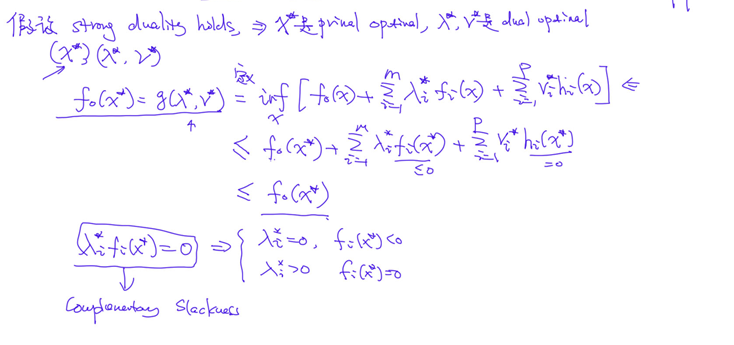

# 二.SVM

SVM另外的名MAX Margin classfier。